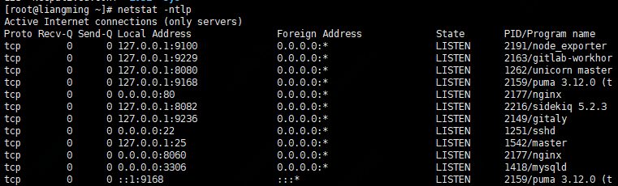

# Gitlab 搭建

## 系统版本：centos6

## 安装命令(依次执行，gitlab为最新版本)
- sudo yum install -y curl policycoreutils-python openssh-server cronie
- sudo lokkit -s http -s ssh
- sudo yum install postfix
- sudo service postfix start
- sudo chkconfig postfix on
- curl https://packages.gitlab.com/install/repositories/gitlab/gitlab-ee/script.rpm.sh | sudo bash
- sudo EXTERNAL_URL="http://gitlab.example.com"(改为自己的网址) yum -y install gitlab-ee

- 安装指导网址:https://about.gitlab.com/install/#centos-6

## 初次使用
- 查看服务器服务:使用 netstat -ntlp 命令
	-  
- 使用浏览器访问搭建gitlab的ip
- 修改root密码，修改后以用户名为root登录
	- 
- 成功登录
	- 

## 搭建成功后常用命令
- sudo gitlab-ctl start    # 启动所有 gitlab 组件；
- sudo gitlab-ctl stop        # 停止所有 gitlab 组件；
- sudo gitlab-ctl restart        # 重启所有 gitlab 组件；
- sudo gitlab-ctl status        # 查看服务状态；
- sudo gitlab-ctl reconfigure        # 启动服务；
- sudo vim /etc/gitlab/gitlab.rb        # 修改默认的配置文件；
- gitlab-rake gitlab:check SANITIZE=true --trace    # 检查gitlab；
- sudo gitlab-ctl tail        # 查看日志；

## 官方文档
- https://docs.gitlab.com/ee/README.html
